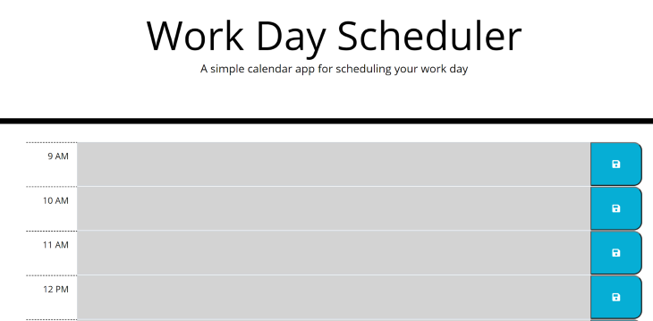
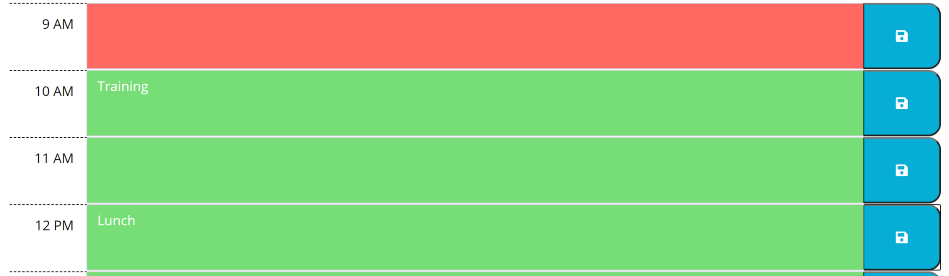

# 05 Third-Party APIs: Work Day Scheduler

## Task

Create a simple calendar application that allows a user to save events for each hour of the day by modifying starter code. This app will run in the browser and feature dynamically updated HTML and CSS powered by jQuery.

# DayPlanner
This web application functions as an event planner for a day of work.

## Functionality 

### Current time sensitivity
The calendar spans a workday from 9AM to 5PM. The current date is displayed at the top of the planner. Each work hour is color-coded based on the current time of day. Hours in the past are gray, the present hour is red, and future hours are green.  

### Event Saving
When the user inputs a new event into an hour time block on the planner, user can save the event into local storage by clicking the blue save button to the right of the event. If a new event is entered and the save button is not clicked, it will not be saved to local storage. 

When the page is re-visited, saved events are added to the planner from local storage. 

## Coding

This project utilizes javascript. A basic html template and styling sheet was provided. Bootstrap was utilized for the styling and for media responsiveness. jQuery was used to select and mainpulate the DOM. Local storage was used to save event data. Moment.js was used to create the time responsiveness in the page. 

## URL 

Github repo link: https://github.com/raynaratcliff/Work-Day-Scheduler-HW5.git 

Github pages: https://raynaratcliff.github.io/Work-Day-Scheduler-HW5/

- - -
© 2021 Trilogy Education Services, LLC, a 2U, Inc. brand. Confidential and Proprietary. All Rights Reserved.
